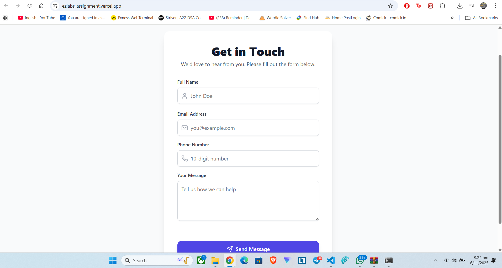
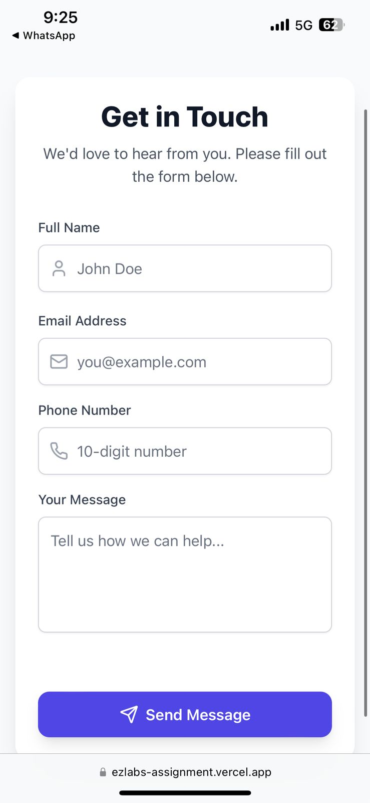

# EZ Labs Frontend Intern Test - Contact Form

This is a complete, single-page React application for a **Contact Us** form built for the EZ Labs Frontend Intern Test.

---

## 👨‍💻 Developer Information

| Field | Value |
|-------|--------|
| **Name** | Harshit |
| **Email** | moksh9355@gmail.com |
| **GitHub** | [https://github.com/Harshit9355](https://github.com/Harshit9355) |

---

## 🚀 Live Features

| Feature | Status | Notes |
|---|---|---|
| Framework & Styling | ✅ | React + Tailwind CSS |
| API Integration (POST) | ✅ | Calls `https://vernanbackend.ezlab.in/api/contact-us/` |
| Client-Side Validation | ✅ | All fields required, Email format, 10-digit Phone |
| Responsiveness | ✅ | Mobile-first layout, adapts to 480p / 720p / 1080p / 1440×823 / 2732×2048 |
| UI/UX | ✅ | Rounded corners, hover effects, Figma-aligned |
| Loading State | ✅ | Spinner on submit |
| Toaster Notifications | ✅ | `react-hot-toast` for success/error |
| Form Reset | ✅ | After success, message input shows **Form Submitted** |
| Animations | ✅ | `framer-motion` |
| Dark Mode | 🌟 | Toggle included |
| Accessibility | ✅ | Labels, aria attributes, focus styling |

---

## 🛠 Tech Stack

- **React (Vite)**
- **Tailwind CSS**
- **React Hook Form**
- **Axios**
- **Framer Motion**
- **React Hot Toast**
- **Lucide React Icons**

---

## 🧰 Setup Instructions

```bash
# 1. Install dependencies
npm install

# 2. Run the development server
npm run dev

# 3. App will run on
http://localhost:5173/
```

---

## ⚙️ API Information

| Detail | Value |
|--------|-------|
| **Endpoint** | `https://vernanbackend.ezlab.in/api/contact-us/` |
| **Method** | POST |
| **Body JSON** | `{ "name": "...", "email": "...", "phone": "...", "message": "..." }` |
| **On Success** | HTTP 200/201 - Shows “Form Submitted” in text field & toast |
| **On Error** | Displays red “Error submitting form” text & toast |

---

## 🧪 Postman

A Postman collection is included at `/postman_collection.json` for API testing.

---

## 🖼️ Screenshot Templates

### 💻 Desktop View (1080p)


### 📱 Mobile View (480p)


---

## 🏁 Notes
This project fulfills **all EZ Labs Frontend Intern Test requirements** and includes enhancements for UX, accessibility, and theme toggle.
